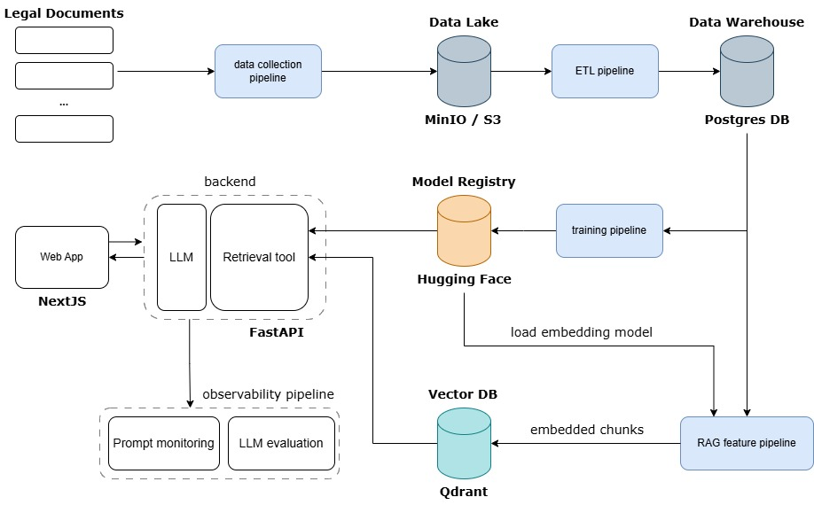
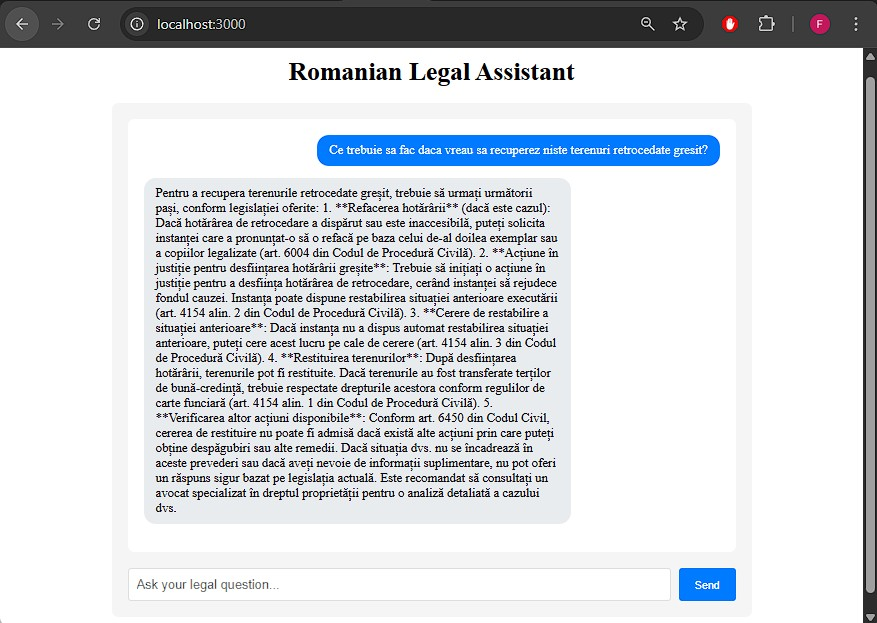

# Romanian Laws RAG

This repository contains a system for collecting, processing, and querying Romanian laws. The system includes various components for data collection and processing, an API for getting legal information and LLM responses and a frontend application. The architecture is designed to be modular and scalable, leveraging Docker for containerization.



## Prerequisites
`Docker` and `CMake` installed.

## Local Deployment
1. Start persistent services:
```bash
make start-persistent-services  # minio, postgres, qdrant
```
2. Run on-demand components:
```bash
make collect-data  # Collect data to MinIO bucket
make process-data  # Save legal articles to Postgres
make generate-embeddings  # Query Postgres, embed and save laws to Qdrant
```
3. Start FastAPI backend and React frontend:
```bash
make start-backend
make start-frontend
```
4. Test backend:
```bash
curl -X POST "http://localhost:8000/query" -H "Content-Type: application/json" -d '{"question": "ce se poate intampla daca fac evaziune fiscala", "top_k": 3}'  # get relevant laws
curl -X POST "http://localhost:8000/ask" -H "Content-Type: application/json" -d '{"question": "ce se poate intampla daca fac evaziune fiscala", "top_k": 3}'  # get llm response interpreting the laws
```

Clear all data:
```bash
make docker-nuke
```

## Web App

